# Mermaid Diagram Test

## Test 1: Simple Architecture Flow

```mermaid
graph LR
    A[🎨 Figma Design] --> B[🐍 Python Pipeline]
    C[🎨 UPS Brand CSS] --> B
    B --> D[🤖 IBM Granite AI]
    D --> E[✅ Validation]
    E --> F[⚡ Angular Component]
    F --> G[🌐 Browser Preview]
    
    style A fill:#e1f5fe
    style C fill:#fff3e0
    style B fill:#f3e5f5
    style D fill:#e8f5e8
    style E fill:#fff9c4
    style F fill:#ffccbc
    style G fill:#c5e1a5
```

## Test 2: 12-Step Pipeline

## Test 3: Technology Stack

## Test 4: Simple System Architecture

---

✅ All diagrams should render properly in GitHub!
