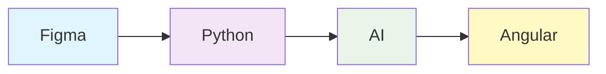
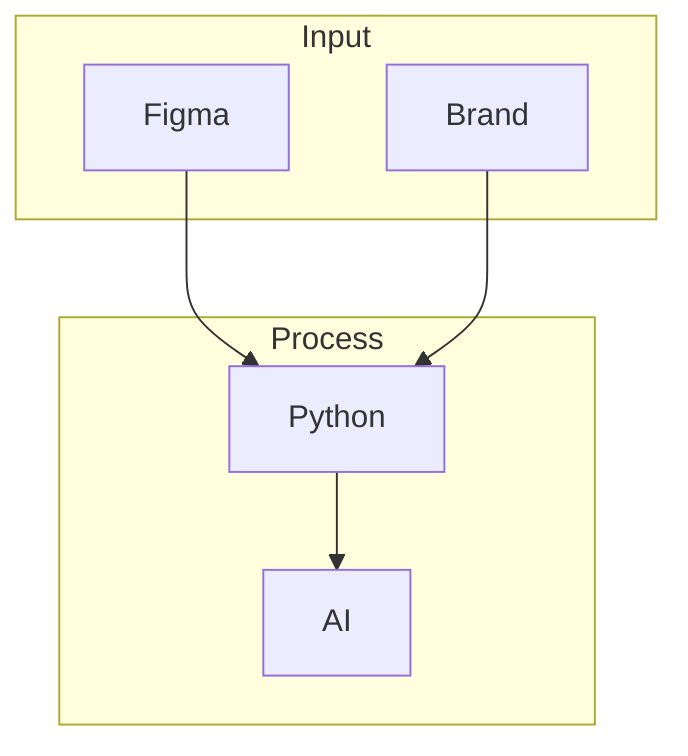
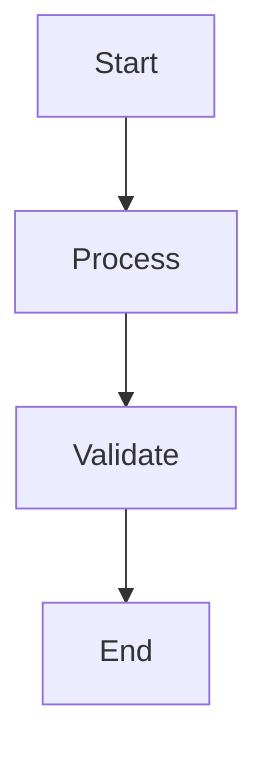

# Test Mermaid Diagrams

## Super Simple Test

```mermaid
graph LR
    A[Start] --> B[End]
```

## Test 2: With Colors

```mermaid
graph LR
    A[Figma] --> B[Python]
    B --> C[AI]
    C --> D[Angular]
    
    style A fill:#e1f5fe
    style B fill:#f3e5f5
    style C fill:#e8f5e8
    style D fill:#fff9c4
```

## Test 3: With Subgraphs

```mermaid
graph TB
    subgraph Input
        A[Figma]
        B[Brand]
    end
    
    subgraph Process
        C[Python]
        D[AI]
    end
    
    A --> C
    B --> C
    C --> D
```

## Test 4: Flowchart

```mermaid
flowchart TD
    Start --> Step1[Process]
    Step1 --> Step2[Validate]
    Step2 --> End
```

If these render correctly, the main diagrams should work too!
